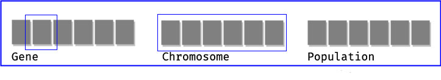
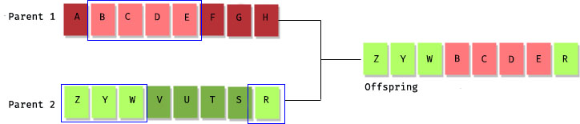
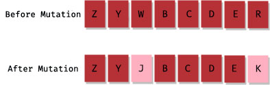

# Genetic Algorithms

Genetic Algorithms (GAs) are adaptive heuristic search algorithms that belong to the larger part of evolutionary algorithms. Genetic algorithms are based on the [ideas of natural selection and genetics](https://en.wikipedia.org/wiki/Natural_selection). These are intelligent exploitation of random search provided with historical data to direct the search into the region of better performance in solution space. They are commonly used to generate high-quality solutions for optimization problems and search problems.

Genetic algorithms simulate the process of natural selection which means those species who can adapt to changes in their environment are able to survive and reproduce and go to next generation. In simple words, they simulate “survival of the fittest” among individual of consecutive generation for solving a problem. Each generation consist of a population of individuals and each individual represents a point in search space and possible solution. Each individual is represented as a string of character/integer/float/bits. This string is analogous to the Chromosome.

## Foundation of Genetic Algorithms

Genetic algorithms are based on an analogy with genetic structure and behavior of chromosome of the population. Following is the foundation of GAs based on this analogy –

1 - Individual in population compete for resources and mate
2 - Those individuals who are successful (fittest) then mate to create more offspring than others
3 - Genes from “fittest” parent propagate throughout the generation, that is sometimes parents create offspring which is better than either parent.
4 - Thus each successive generation is more suited for their environment.

## Search space

The population of individuals are maintained within search space. Each individual represent a solution in search space for given problem. Each individual is coded as a finite length vector (analogous to chromosome) of components. These variable components are analogous to Genes. Thus a chromosome (individual) is composed of several genes (variable components).

## Fitness Score

A Fitness Score is given to each individual which shows the ability of an individual to “compete”. The individual having optimal fitness score (or near optimal) are sought.

The GAs maintains the population of n individuals (chromosome/solutions) along with their fitness scores.The individuals having better fitness scores are given more chance to reproduce than others. The individuals with better fitness scores are selected who mate and produce better offspring by combining chromosomes of parents. The population size is static so the room has to be created for new arrivals. So, some individuals die and get replaced by new arrivals eventually creating new generation when all the mating opportunity of the old population is exhausted. It is hoped that over successive generations better solutions will arrive while least fit die.

Each new generation has on average more “better genes” than the individual (solution) of previous generations. Thus each new generations have better “partial solutions” than previous generations. Once the offsprings produced having no significant difference than offspring produced by previous populations, the population is converged. The algorithm is said to be converged to a set of solutions for the problem.

## Operators of Genetic Algorithms

Once the initial generation is created, the algorithm evolve the generation using following operators:

1 - Selection Operator: The idea is to give preference to the individuals with good fitness scores and allow them to pass there genes to the successive generations.
2 - Crossover Operator: This represents mating between individuals. Two individuals are selected using selection operator and crossover sites are chosen randomly. Then the genes at these crossover sites are exchanged thus creating a completely new individual (offspring). For example:

3 - Mutation Operator: The key idea is to insert random genes in offspring to maintain the diversity in population to avoid the premature convergence. For example:

### The whole algorithm can be summarized as:

1 - Randomly initialize populations p
2 - Determine fitness of population
3 - Untill convergence repeat:

      a) Select parents from population
      b) Crossover and generate new population
      c) Perform mutation on new population
      d) Calculate fitness for new population
      
Acknowledgements to [Atul Kumar](https://www.linkedin.com/in/atul-kumar-733b32136/) and his article at [GeeksForGeeks](https://www.geeksforgeeks.org/genetic-algorithms/)
